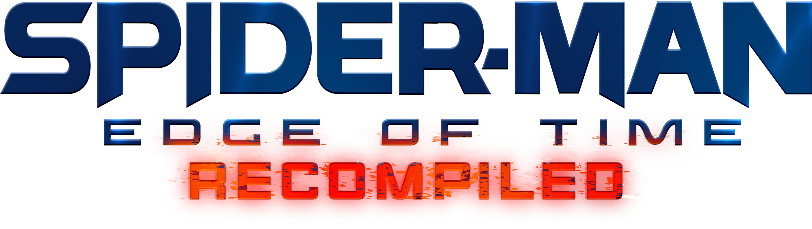

> [!CAUTION]
> This project is in private development. Building from this source code from the repository will not build the game or get it working. A public release will be available October 4th

> [!IMPORTANT]
> This project does not include any game assets. 
> You must provide the files from your own legally acquired copy of the game to install or build EdgeOfTimeRecompiled.

<h1 align="center">
  
  
  
  

</h1>

# EdgeOfTimeRecompiled

EdgeOfTimeRecompiled is an unofficial PC port of the Xbox 360 version of "Spider-Man: Edge Of Time" created through the process of static recompilation. The port offers Windows, macOS, and Linux support with goals for numerous built-in enhancements such as high resolutions, ultrawide support, high frame rates, improved performance and modding.

EdgeOfTimeRecompiled uses the ReXGlue SDK to convert PowerPC Assembly to static C++ code that can be compiled to any platform, with a custom XenosRecomp fork to convert Xbox 360 Shaders from the compiled shader container to static HLSL code. Given that the system is currently in development, there are no recommended or minimum settings designed at the moment, and no playtesters to confirm or deny any settings. As mentioned in rules, ***THERE IS NO OFFICIAL RELEASE AS OF JULY 2026, DO NOT TRUST ANYONE CLAIMING THEY HAVE A PC PORT***

## Table of Contents

- [Minimum System Requirements](#minimum-system-requirements)
- [How to Install](#how-to-install)
- [Features](#features)
- [Mods](#mods)
- [Building](#building)
- [Dev Notes](#notes)
- [Credits](#credits)

## Minimum System Requirements

- CPU with support for the AVX instruction set:
  - Intel: Haswell CPU's (Intel Core 5th Generation)
  - AMD: Bulldozer (AMD FX series)
  - Apple: Any AppleSilicon Processor 
- GPU with support for Direct3D 12.0 (Shader Model 6) or Vulkan 1.2:
  - NVIDIA: GeForce GT 730 (Kepler)
  - Intel: HD Graphics 620 (Kaby Lake)
  - Apple: Any AppleSilicon GPU thanks to MoltenVK
- Memory:
  - 8 GB minimum
- Operating System:
  - Windows 10 (version 1909)
  - Linux Distibution w/ glibc v2.41
  - macOS Ventura (13.3)
- Storage:
  - 10 GB Required

These requirements presume that you can run the game at it's original 1120x632 resolution and at the Original graphics preset that the game offers. For more information on the resolution and quality preset specifics, [Check out the Performance Guide](/docs/Video-Graphics.md).
 
## How to Install

1) You must have access to the following:

    - Xbox 360 (modifications not necessary)
    - Xbox 360 Storage Device (either an Xbox 360 hard drive or an external USB storage device)
    - Xbox 360 Hard Drive Transfer Cable or a compatible SATA to USB adapter (only required for dumping from an Xbox 360 hard drive)
    - Spider-Man: Edge of Time for Xbox 360 (US)
        - Title Update required.
        - DLC (Identity Crisis) is optional.

> [!TIP]
> If you do not have the Xbox 360 Hard Drive Transfer Cable, please ensure that you purchase the correct revision of it for your console.
>
> The latest revision works with both original Xbox 360 and Xbox 360 S|E hard drives, but the first revision only works with original Xbox 360 hard drives.
>
> To know which is which, the first revision cable is gray, whereas the latest revision (which supports any Xbox 360 hard drive) is black.

2) **Before proceeding with the installation**, make sure to follow the guide on how to acquire the game files from your Xbox 360.

    - Xbox 360 Hard Drive Dumping Guide
        - [English](/docs/DUMPING-en.md)
    - Xbox 360 USB Dumping Guide
        - [English](/docs/DUMPING-USB-en.md)

3) Download [the latest release](https://github.com/goliathret/EdgeOfTimeRecomp/releases/latest) of EdgeOfTimeRecompiled and extract it to where you'd like the game to be installed. 
    - If you are on Windows, install the `REEOT-Windows.zip` 
    - If you are on Linux/Steam Deck, install the `REEOT-Linux.appimage`
    - If you are on macOS, install the `REEOT-macOS.dmg`

4) Run the executable and you will be guided through the installation process. You will be asked to provide the files you acquired in the previous step. When presented with options for how to do this:

    - **Add Files** will only allow you to provide **containers or images dumped from an Xbox 360**. These often come in the form of very large files without associated extensions. Don't worry if you're not aware of what's inside of them, the installer will automatically detect what type of content is inside the container.
    - Folder Support is unavailable at the moment, but will be looked into post-release.

> [!NOTE]
> Please note that it is **not possible** to complete the installation if your files have been **modified**. In case of other problems such as black screens or crashes, **do not try to reinstall the game** as it is not possible for the process to result in an invalid installation.

## Features

EdgeOfTimeRecompiled contains a plethora of integrated features that far exceed the original PC Ports of the accompanying Beenox titles offered. Two of the biggest features are the dedicated Video and Graphics Settings, both being powered by a built-from-scratch HLE renderer that hooks directly onto game code to activate rendering functionality, often referred to as a [Native Renderer](/docs/RENDERER.md). 

### Native Renderer

The Video and Graphics Settings include:
- Display Control
    - Windowed Modes
    - Resolution Presets
    - Aspect Ratios
    - Various Picture Quality Tweaks
- Graphics Control
    - Dedicated Graphics Presets (Customizable)
    - Anti-Aliasing methods
    - Anisotropic Quality
    - Various Rendering Quality Tweaks

Whilst EdgeOfTimeRecompiled is an Xbox 360 title ported to PC, many optimizations have been made to make it perform smoothly on modern PC's. It can run on lower-end Devices based on our testing, but we cannot confirm if it can run on every unique device perfectly. The project also is bundled with a few **Upscaled Textures** for the original suits that have been meticulously injected in a way to prevent performance dips, but there will be a way to toggle them off in the Bonus Gallery. EdgeOfTimeRecompiled is much closer to a remaster for Modern Computers in this sense, rather than a port meant for PC's made in the late 2000'/early 2010's.

If you are recieving performance issues with your device, you can learn more from our documentation and [check out the Preset Guide](/docs/Video-Graphics.md). If all else fails, you can report a GitHub Issue in our Repository.

### Input Settings

EdgeOfTimeRecompiled offers support for nearly every HID controller through ReXGlue's built in XSB translation layer. Additionally, there is a native KeyBoard and Mouse mode that hooks directly into Edge of Time to use the mouse's movement as a camera controller.  Each controller comes with dedicated glyphs based on the HID type, and there is a page for manipulating the keybinds in EdgeOfTime for both controllers and KBM.

By default, EdgeOfTimeRecompiled uses the following keyboard and mouse binds. Every action can be rebound under **Controllers > Keybinds > Edge of Time** in the settings overlay:

Action|Key|Controller Equivalent
-|-|-
Move|W / A / S / D|Left Stick
Camera|Mouse|Right Stick
Jump|Space|A (Cross)
Light Attack|Left Mouse Button|X (Square)
Heavy Attack|Middle Mouse Button|Y (Triangle)
Web / Interact|E|B (Circle)
Grab|Q|Right Bumper (R1)
Special Attack / Throw Object|V|Left Bumper (L1)
Web Swing (Hold)|Right Mouse Button|Right Trigger (R2)
Special Ability (HS/AD)|Shift|Left Trigger (L2)
Wall Stick|Z|L3
Center Camera|X|R3
Time Stop|Z + X|L3 + R3
Spider-Sense|R|D-Pad Up
D-Pad Down|C|D-Pad Down
D-Pad Left|Unbound|D-Pad Left
D-Pad Right|Unbound|D-Pad Right
Upgrades|Tab|Back (Select)
Pause|Escape|Start

### Language Settings

Audio and Language Settings are morphed together into one page, allowing users to choose the langauge they want and adjust any audio controls together. With the announcement of EdgeOfTimeRecompiled, one of the release-day mods will be a full Russian translation, installable through the game's own translation loader (see [Mods](#mods)). 

Other changes to Audio include an expanded page. It keeps the original FX, Voice, and Music Volume sliders, shown as percentages in 5% steps, and the Subtitles toggle. Two new toggles, Spatial Audio and Battle Theme, are on the page too, both offering methods on disabling the game's battle theme and echoing audio to help provide an experience closer to the other consoles. The Language selector offers Auto (which follows the Windows display language), English, French, Italian, German, and Spanish, and a change takes effect after restarting the game. 

## Mods

EdgeOfTimeRecompiled has a built-in Mods page on the Options bar (currently only shown while debug mode is on) or the CLI. **Pak Replacement** swaps out one of the game's packages in `Data`, while **Model Import** installs a custom costume package in place of the DLC suits. The original files are backed up to `mods/backup` before anything is replaced, so the **Restore** button always brings back the untouched game, and every change takes effect the next time the game starts. Translations are recommended to be installed via the CLI. For more info on this whole system [check out the Mods guide](/docs/MODS.md).

## Building

[Check out the building instructions here](/docs/BUILDING.md).

## Notes

EdgeOfTimeRecompiled is a project that was created by dozens of Spider-Man fans who all love the game. This project does not contain AI Generated "Vibe-Coded" content, nor contains AI Art assets or AI translations. We are not dismissive of AI Usage, but we have extreme limits and choose to be hesitant on accepting code that is developed without reversing at hand. For more about this, [Check out the Contributions Page here](/docs/CONTRIBUTING.md). 

If you have more questions about certain parts of the project and how we approaching certain subsystems (notably rendering), feel free to message us in our [Discord Server](https://discord.gg/PsReBEDDZX). We have spent a lot of time on this project, and are extremely excited to finally present the final product.

## Credits

Huge thanks to everyone who's put time into this. EdgeOfTimeRecompiled wouldn't be where it is without you.

### Development
* **[Graine25](https://github.com/Graine25)**: Creator of EdgeOfTimeRecompiled and maintainer of the ReXGlue SDK.
* **[Serjar](https://www.youtube.com/channel/UCaCoblwXlhhZFoJVPc8L2cg)**: one of the few people outside of the original beenox dev team who knows EdgeOfTime like the back of their hand. A lot of the reversing, between understanding the PAK format and how it interacts in the game code, would not have been possible without his help.
* **[Maff](https://github.com/spyrosadventure)**: created reversing notes on Skylanders SuperChargers Racing and developed a majority of the PKZLib pipeline we use to create custom PKZ's

### Playtesting & Support
* **[hellomemy]()** -  Suit Designer
* **[OMMAC](https://ko-fi.com/kujo892483)** -  Artwork Designer
* **ManOfGallifrey** -  Playtester
* **[FrankyBuster](https://github.com/FrankyBuster)** -  Playtester
* **RRT94** -  Playtester
* **[Hako](https://github.com/hakodev)** -  Playtester
* **[CB1018ZR](https://github.com/CB1018ZR)** -  Playtester
* **SSG** -  Playtester
* **Tiny** -  Playtester
* **[KinglyNerd](https://github.com/kinglynerd33)** -  Playtester
* **[Snap](https://github.com/SpiderHam959)** -  Playtester
* **VinBin** -  Playtester
* **Starlight** -  Playtester

### Community Projects
* The **[ReXGlue SDK](https://github.com/rexglue/rexglue-sdk)** team, for the toolchain this project is built on.
* **[UnleashedRecompiled](https://github.com/hedge-dev/unleashedrecomp/)** for setting the bar on how incredible a Static Recompilation can be, and proving to a wider audience that 360 titles can be relived on modern computers. 
* The wider **Xbox 360 emulation scene**, namely [Xenia Canary](https://github.com/xenia-canary/xenia-canary). A lot of the hardest problems were solved by them long before this project started.

## License

See [LICENSE](LICENSE).

